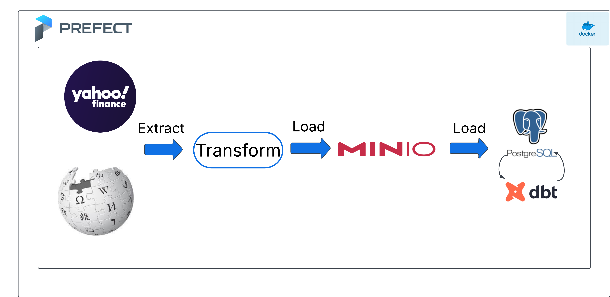
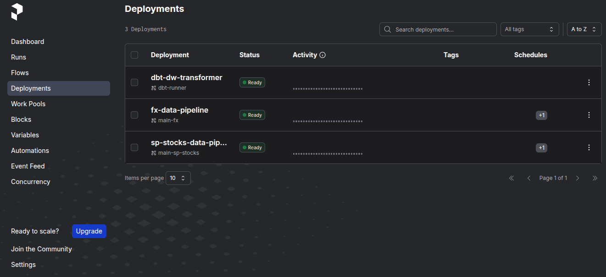
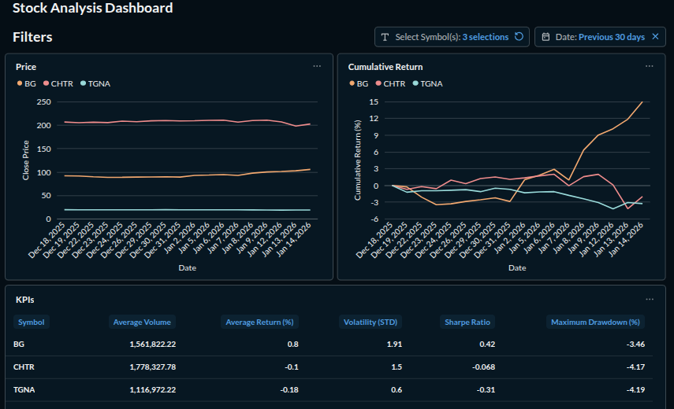

# Securities Data Pipeline


# Overview
A data pipeline is a series of steps that automate the extraction, transformation, and loading (ETL) of data from various sources into a data warehouse or data lake. This process is crucial for organizations that rely heavily on data-driven decision making. In investment management and algorithmic trading, a data pipeline is essential for:
* Gathering and analyzing historical market data to identify trends, patterns, and potential investment opportunities.
* Building and optimizing investment portfolios based on historical data and risk models.
* Developing and backtesting trading algorithms using historical market data.

In this project, I built a data pipeline to extract, transform, and load forex and stock price data into a data lake and data warehouse.

The pipeline gathers and stores data for major forex currency pairs and stocks tracked by the SP500, SP400, and SP600 indices. The data is first loaded into a s3 bucket, which serves as the data's raw landing zone, before being loaded into Postgres for dimensional modelling with dbt.

# Tools Used
* **yfinance**: for extracting stocks and fx price data from Yahoo Finance.
* **DuckDB**: for extracting and loading data into an S3 bucket.
* **MinIO**: for storing extracted and transformed data in a local S3 bucket.
* **Postgres**: for storing the data in a local data warehouse.
* **dbt**: for transforming and modelling the data in the data warehouse
* **Prefect**: for workflow orchestration, monitoring, and scheduling.
* **Docker**: for containerizing the project for local and cloud deployment.
* **Metabase**: for data visualization.

# Setting up and running the pipeline locally 
Ensure you have Docker installed on your system. The following steps were tested on Ubuntu 22.04.

1. Clone the repository and switch to the project directory:
    ```bash
    git clone https://github.com/tiloye/securities-data-pipeline.git
    cd securities-data-pipeline
    ```
2. Setup Minio, Postgres, and Prefect Server:
    ```bash
    docker compose -f=./docker/prod/compose.yml up -d
    ```
    You can access the Minio, Prefect, and Metabase UIs using the URLs below:

    * **Minio**: localhost:9003
    * **Prefect**: localhost:4201
    * **Metabase**: localhost:3000

3. Create ".env.prod" file with the following values in the project directory:
    ```
    ENV_NAME=prod

    S3_ENDPOINT=http://127.0.0.1:9002
    BUCKET_NAME=securities-data-lake

    PREFECT_API_URL=http://127.0.0.1:4201/api
    ```
4. Create an AwsCredentials and SQLAlchemyConnector block with the following values, using the prefect UI (localhost:4201):

    * **AwsCredentials** block:
        - Block Name: sec-datalake-credentials
        - AWS Access Key ID: minioadmin (or your S3 access key)
        - AWS Access Key Secret: minioadmin (or your S3 secret key)

    * **SQLAlchemyConnector** block:
        - Block Name: sec-dw-connector
        
        Under "Connection Info", choose "ConnectionComponents" and fill in your database credentials:
        - Host: localhost
        - Port: 5433
        - Database: securities_db
        - Username: postgres
        - Password: postgres
    
    Ensure these credentials match your production (local) datalake and warehouse credentials.

5. Create docker image for the pipeline:
    ```
    docker compose -f ./docker/pipeline/compose.yml --env-file=.env.prod build
    ```
6. Deploy the pipeline as a Prefect flow:
   ```
   docker run --rm -it --network=host securities-data-pipeline:latest python -m py_pipeline.deploy
   ```

Your Prefect UI should have three deployments as shown in the image below:



The deployments "fx-data-pipeline" and "sp-stocks-data-pipeline" are scheduled to run at 12am utc Tuesday through Saturday, extracting the previous day's data from the source and loading it into the data lake and data warehouse on each run. The "dbt-dw-transformer" deployment is activated when the "fx-data-pipeline" and "sp-stocks-datapipeline" run successfully, transforming the data loaded into the data warehouse.

Once the data loaded into the data warehouse and transformed. You can build a dashoard with [metabase](metabase.com) for analyzing historical market data to identify trends, patterns, and potential investment opportunities.



# Areas of Improvement

* **Integrate Institutional-Grade Data Sources**: Transition from yahoo finance to comprehensive market data providers like Databento or Massive for high-fidelity historical and real-time stock data.

* **Implement Task Caching**: Utilize Prefect’s caching mechanisms to prevent redundant API requests to source systems, ensuring that failed runs can be retried without exceeding rate limits or wasting compute.

* **Automated Data Documentation**: Deploy a dbt documentation server locally (or via GitHub Pages) to provide a searchable data dictionary and visual lineage for all transformed models.

* **Comprehensive Data Quality Tests**: Expand testing beyond basic data tests to include automated data profiling and drift detection to ensure long-term data integrity.

* **Cloud Deployment**: Migrate the local Docker stack to a cloud environment (AWS/GCP), swapping MinIO for S3 and moving the orchestration layer to managed services like Prefect Cloud for better scalability.

* **CI/CD Pipeline Integration**: Automate the execution of the pytest and dbt test via GitHub Actions to enforce code quality and prevent breaking changes from reaching the main branch.

# Resources
* [Data Engineering Zoomcamp, Modules 1 & 2](https://github.com/dataTalksClub/data-engineering-zoomcamp/)
* [Prefect Docs](https://docs.prefect.io/)
* [dbt Docs](https://docs.getdbt.com/)
* [Metabase Docs](http://metabase.com/docs)