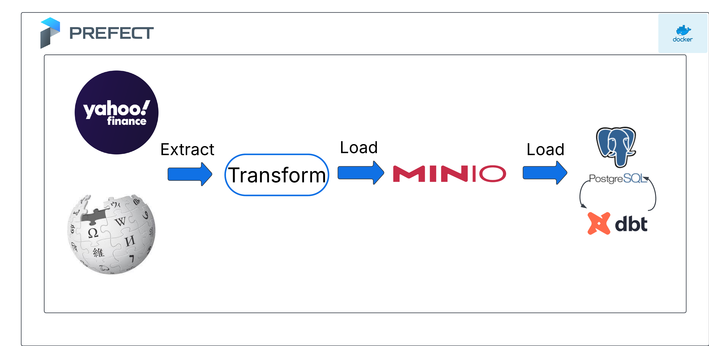
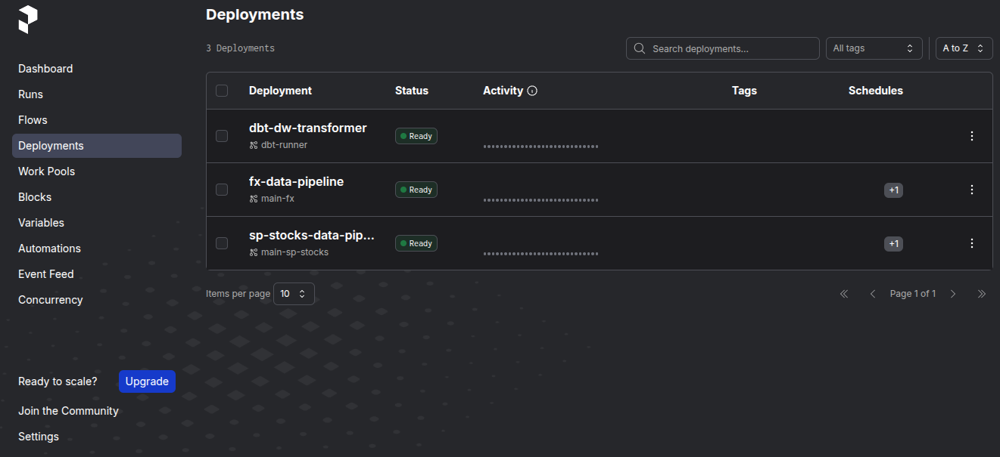
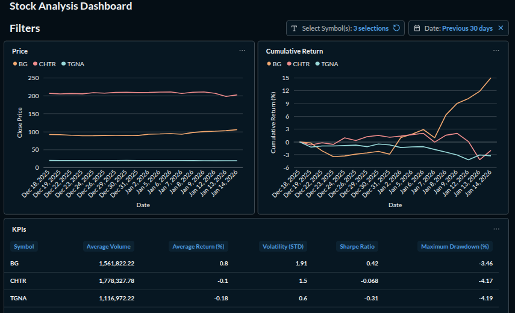

# Securities Data Pipeline


# Overview
A data pipeline is a series of steps that automate the extraction, transformation, and loading (ETL) of data from various sources into a data warehouse or data lake. This process is crucial for organizations that rely heavily on data-driven decision making. In investment management and algorithmic trading, a data pipeline is essential for:

* Gathering and analyzing historical market data to identify trends, patterns, and potential investment opportunities.
* Building and optimizing investment portfolios based on historical data and risk models.
* Developing and backtesting trading algorithms using historical market data.

In this project, I built a data pipeline to extract, transform, and load forex and stock price data into a data lake and data warehouse.

The pipeline gathers and stores data for major forex currency pairs and stocks tracked by the SP500, SP400, and SP600 indices. The data is first loaded into a s3 bucket, which serves as the data's raw landing zone, before being loaded into a data warehouse for dimensional modelling with dbt.

# Tools Used
* **yfinance**: for extracting stocks and fx price data from Yahoo Finance.
* **dlt**: for loading data into the data lake and data warehouse.
* **MinIO & AWS S3**: for datalake storage.
* **Postgres & Snowflake**: for data warehouse storage.
* **dbt**: for transforming and modelling the data in the data warehouse
* **Prefect**: for workflow orchestration, monitoring, and scheduling.
* **Docker**: for containerizing the project for local deployment.
* **Metabase**: for data visualization.

# Set up and run the pipeline locally 
Ensure you have Docker installed on your system. The following steps were tested on Ubuntu.

1. Clone the repository and switch to the project directory:
    ```bash
    git clone https://github.com/tiloye/securities-data-pipeline.git
    cd securities-data-pipeline
    ```
2. Setup Minio, Postgres, and Prefect Server:
    ```bash
    docker compose -f=./docker/prod/compose.yml up -d
    ```
    You can access the Minio, Prefect, and Metabase UIs using the URLs below:

    * **Minio**: localhost:9003
    * **Prefect**: localhost:4201
    * **Metabase**: localhost:3000

3. Create ".env.prod" file with the following values in the project directory:
    ```
    ENV_NAME=prod

    S3_ENDPOINT=http://127.0.0.1:9002
    BUCKET_NAME=securities-data-lake

    DB_TYPE=postgres
    DB_NAME=securities_db

    PREFECT_API_URL=http://127.0.0.1:4201/api
    ```
4. Configure Prefect Blocks:
    Navigate to the Prefect UI (`http://localhost:4201`) and create the following connection blocks:

    - **AwsCredentials** block:
        - **Block Name:** `sec-datalake-credentials`
        - **AWS Access Key ID:** `minioadmin` (or your specific S3 access key)
        - **AWS Access Key Secret:** `minioadmin` (or your specific S3 secret key)

    - **Secret** block:
        - **Block Name:** `sec-dw-credentials`
        - **Value (JSON):** `{"username": "postgres", "password": "postgres", "host": "localhost", "port": 5433}`
    
    Ensure these credentials match your production (local) datalake and warehouse credentials.

5. Create docker image for the pipeline:
    ```
    docker compose -f ./docker/pipeline/compose.yml --env-file=.env.prod build
    ```
6. Deploy the pipeline as a Prefect flow:
   ```
   docker run --network host --rm securities-data-pipeline:latest prefect deploy --no-prompt --prefect-file prefect.local.yaml --all
   ```

# Set up and run the pipeline with Prefect cloud, AWS S3, and Snowflake
The following steps were tested on Ubuntu.

1. Clone the repository and switch to the project directory:
    ```bash
    git clone https://github.com/tiloye/securities-data-pipeline.git
    cd securities-data-pipeline
    ```
2. Create an AWS S3 bucket and a database in Snowflake with the name "securities_db".

3. Create `.env.cloud` file with the following values in the project directory:
    ```
    ENV_NAME=cloud

    S3_ENDPOINT=https://s3.amazonaws.com
    BUCKET_NAME=securities-data-lake # Replace with your bucket name

    DB_TYPE=snowflake
    DB_NAME=securities_db

    PREFECT_API_URL=<your_prefect_api_url>
    PREFECT_API_KEY=<your_prefect_api_key>
    ```
4. Configure Prefect Blocks:
    Navigate to your Prefect cloud UI and create the following blocks:

    - **AwsCredentials** block:
        - **Block Name:** `sec-datalake-credentials`
        - **AWS Access Key ID:** `<your_aws_access_key>`
        - **AWS Access Key Secret:** `<your_aws_secret_key>`

    - **Secret** block:
        - **Block Name:** `sec-dw-credentials`
        - **Value (JSON):** `{"username": "<your_snowflake_username>", "password": "<your_snowflake_password>", "host": "<your_snowflake_account_id>"}`

5. Install and export the dependencies for the pipeline:
    ```bash
    uv sync --no-dev --extra snowflake
    uv export --format requirements.txt --no-dev --extra snowflake --no-hashes --no-header --no-annotate --no-editable --no-emit-project -o requirements.txt
    ```

6. Deploy to prefect cloud:
    ```bash
    set -a && source .env.cloud
    prefect deploy --no-prompt --all --prefect-file prefect.cloud.yaml
    ```

Your Prefect UI should have three deployments as shown in the image below:



The deployments "fx-data-pipeline" and "sp-stocks-data-pipeline" are scheduled to run at 12am utc Tuesday through Saturday, extracting the previous day's data from the source and loading it into the data lake and data warehouse on each run. The "dbt-dw-transformer" deployment is activated when the "fx-data-pipeline" and "sp-stocks-datapipeline" run successfully, transforming the data loaded into the data warehouse.

Once the data loaded into the data warehouse and transformed. You can build a dashoard with [metabase](metabase.com) for analyzing historical market data to identify trends, patterns, and potential investment opportunities.



# Areas of Improvement

* **Integrate Institutional-Grade Data Sources**: Transition from yahoo finance to comprehensive market data providers like Databento or Massive for high-fidelity historical and real-time stock data.

* **Implement Task Caching**: Utilize Prefect’s caching mechanisms to prevent redundant API requests to source systems, ensuring that failed runs can be retried without exceeding rate limits or wasting compute.

* **Automated Data Documentation**: Deploy a dbt documentation server locally (or via GitHub Pages) to provide a searchable data dictionary and visual lineage for all transformed models.

# Resources
* [Data Engineering Zoomcamp](https://github.com/dataTalksClub/data-engineering-zoomcamp/)
* [Prefect Docs](https://docs.prefect.io/)
* [dbt Docs](https://docs.getdbt.com/)
* [Metabase Docs](http://metabase.com/docs)